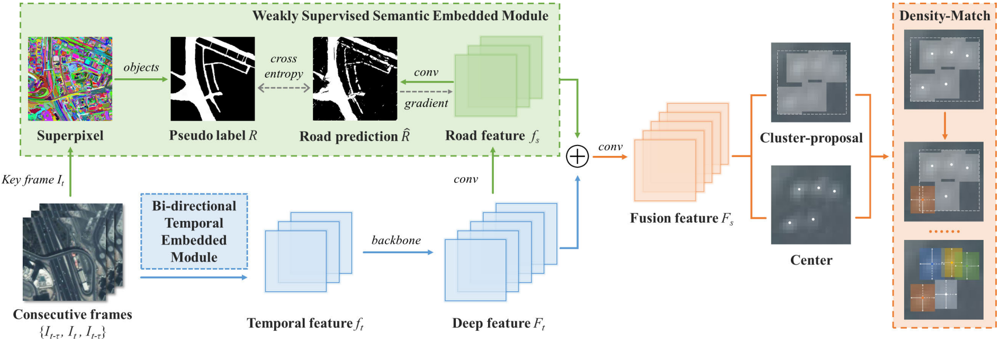

# SDANet: Semantic-embedded density adaptive network for moving vehicle detection in satellite videos

## Abstract

In satellite videos, moving vehicles are extremely small-sized and densely clustered in vast scenes. Anchor-free detectors offer great potential by predicting the keypoints and boundaries of objects directly. However, for dense small-sized vehicles, most anchor-free detectors miss the dense objects without considering the density distribution. Furthermore, weak appearance features and massive interference in the satellite videos limit the application of anchor-free detectors. To address these problems, a novel semantic-embedded density adaptive network (SDANet) is proposed. In SDANet, the cluster-proposals, including a variable number of objects, and centers are generated parallelly through pixel-wise prediction. Then, a novel density matching algorithm is designed to obtain each object via partitioning the cluster-proposals and matching the corresponding centers hierarchically and recursively. Meanwhile, the isolated cluster-proposals and centers are suppressed. In SDANet, the road is segmented in vast scenes and its semantic features are embedded into the network by weakly supervised learning, which guides the detector to emphasize the regions of interest. By this way, SDANet reduces the false detection caused by massive interference. To alleviate the lack of appearance information on small-sized vehicles, a customized bi-directional conv-RNN module extracts the temporal information from consecutive input frames by aligning the disturbed background. The experimental results on Jilin-1 and SkySat satellite videos demonstrate the effectiveness of SDANet, especially for dense objects.



## Installation

### Requirements

- Linux or macOS with Python ≥ 3.8
- PyTorch ≥ 1.13 is recommended and [torchvision](https://github.com/pytorch/vision/) that matches the PyTorch installation. 
- `pip install -r requirements.txt`

## Data Preparation

Firstly, prepare the video data in the MOT16 dataset format, and copy the generated pseudo-label images of the roads to the 'road' folder. Then run the 'datasets/mot2coco.py'.

### Expected data structure

```
satellite videos/
  001/
    gt/
      gt.txt
    img/
      000001.png
      ...
    road/
      000001.png
      ...
  ...
  # below are generated by datasets/mot2coco.py
    annotations/
      train.json
      val.json
    train/
      000001.png
      ...
    val/ 
      000001.png
      ...
```

## Training

For training the model, run:

`python train.py`

The hyperparameters can be set through ‘opt.py’.

## inferencing

For testing the model, run:

`python test.py`

The hyperparameters can be set through ‘opt.py’.

## Acknowledgement

We would like to acknowledge the contributions of public projects, especially [CenterNet](https://github.com/xingyizhou/CenterNet), whose code has been utilized in this repository. 

## license

This project is released under the MIT(LICENSE) license.

## Citing SDANet

```
@article{feng2023sdanet,
  title={SDANet: Semantic-embedded density adaptive network for moving vehicle detection in satellite videos},
  author={Feng, Jie and Liang, Yuping and Zhang, Xiangrong and Zhang, Junpeng and Jiao, Licheng},
  journal={IEEE transactions on image processing},
  volume={32},
  pages={1788--1801},
  year={2023},
  publisher={IEEE}
}
```

